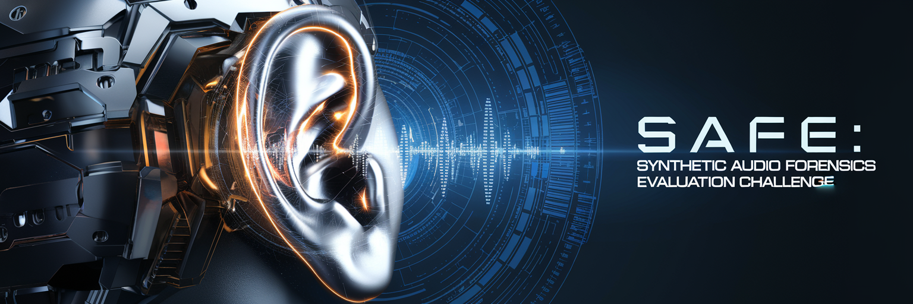

# [WIP] SAFE: Synthetic Audio Forensics Evaluation Challenge 

## Overview

To advance the state of the art in audio forensics, we are launching a funded evaluation challenge at [IHM&MSEC2025](https://www.ihmmsec.org/cms/home/index.html) to drive innovation in detecting and attributing synthetic and manipulated audio artifacts. This challenge will focus on several critical aspects, including generalizability across diverse audio sources, robustness against evolving synthesis techniques, and computational efficiency to enable real-world applications. The rapid advancements in audio synthesis, fueled by the increasing availability of new generators and techniques, underscore the urgent need for effective solutions to authenticate audio content and combat emerging threats. Sponsored by the ULRI Digital Safety Research Institute, this initiative aims to mobilize the research community to address this pressing issue. The most promising solutions will be eligible for research grants to further advance their development. 

**All participants are required to register for the competition**

- Sign up here to participate and receive updates: [TBD]().
- For info please contact: TBD

## Important Dates

- Practice Submission Opens: February 26, 2025
- Competition Opens: March 3, 2025
- Round 1 Submission deadline: May 05, 2025 (the papers accepted in Round 1 will be published in the proceedings for IH&MMSEC 2025)
- Round 2 Submission deadline: June 02, 2025 (competition will close after Round 2)

## Data

The dataset will consist of human and machine generated speech audio tracks. 

- Human generated speech will be sourced from multiple sources including but not limited to high quality in-studio and lower quality in-the-wild online recordings.
- Machine generated speech will be constructed using several SOTA TTS (text-to-speech) models. The models will be either open-source or closed-source.
- The audio files will vary in length but will be no longer than 60 seconds.
- Compression formats will also vary but the files will be saved as WAVs to simplify reading.
- The dataset will be balanced across sources. Each source (source of real audio and source of generated audio) will have an equal number of samples. 
- **This competition will be fully blind.** No data will be released. Only a small sample dataset will be released as part of a sample model.
  
## Model Submission

This is a code based competetion. We will be using [hugginface competions platform](https://github.com/huggingface/competitions). No data will be released before the competition. A subset of the data may be released after the competition. 

- Participants will be required to submit their model to be evaluated on the dataset.
- Create a huggingface model repo
- The model will be expected to read in the dataset and output file containing a **detection score and binary decision** for every input example.
- Common python ML frameworks like pytorch will be supported.

## Tasks  

The competition will consist of three detection tasks. For each task, the object is to detect if an audio file contains machine generated speech. Not all tasks will be open at the same time.  
- Practice (✅ Open): A practice task to troubleshoot model submission.  
        https://huggingface.co/spaces/safe-challenge/SAFEChallengePractice
- Task 1 (❌ Closed): Detection of Raw Generated Audio. Audio files are unmodified from the original output from the models or the pristine sources.
        https://huggingface.co/spaces/safe-challenge/SAFEChallengeTask1 
- Task 2 (❌ Closed): Detection of Processed Audio. Audio files will be compressed with several common audio compression codecs. The audio files will also be resampled according to several sampling rates.
- Task 3 (❌ Closed): Bonus Task (Details TBD)

## Evaluation

All submissions will be evalulated using balanced accuracy. Balanced accuracy is defined as an average of true positive rate and true negative rate. 

The competition page will maintain a public leaderboard and a private leaderboard. The data will be devided along the sources such that public and private leaderboards will be non-overlapping. Public leaderboard will also show error rates for every source, However, the specific source name will be anonymized. See the following table as an example.

- After the competition closes, we will provide additional metrics broken down by source and other data attributes.
- This is why we ask you to provide a continous decision score for every input example in addition to a hard binary decision.

## Rules

To ensure a fair and rigorous evaluation process for the SAFE: Synthetic Audio Forensics Evaluation Challenge (SAFE), the following rules must be adhered to by all participants:

1. **Leaderboard**:
   - The competition will maintain both a public and a private leaderboard.
   - The public leaderboard will show error rates for each anonymized source.
   - The private leaderboard will be used for the final evaluation and will include non-overlapping data from the public leaderboard.

2. **Submission Limits**:
   - Participants will be limited to a certain number of submissions per day.

3. **Confidentiality**:
   - Participants agree not to publicly compare their results with those of other participants until the other participant’s results are published outside of the IHM&MSEC2025 venue.
   - Participants are free to use and publish their own results independently.

4. **Compliance**:
   - Participants must comply with all rules and guidelines provided by the organizers.
   - Failure to comply with the rules may result in disqualification from the competition and exclusion from future evaluations.

By participating in the SAFE challenge, you agree to adhere to these evaluation rules and contribute to the collaborative effort to advance the field of audio forensics.
